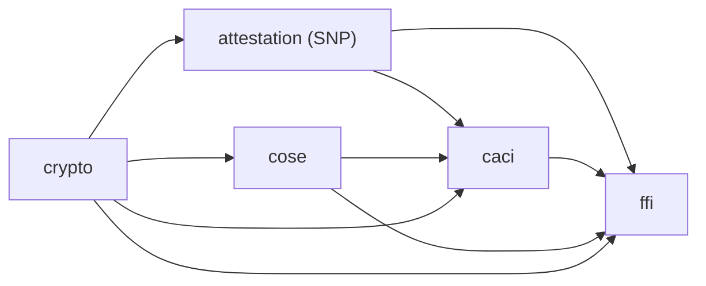

# TEE Attestation Verification

Portable Rust libraries and demos for verifying trusted execution environment
attestations.

The workspace currently focuses on AMD SEV-SNP attestation reports: parsing the
report, verifying AMD certificate collateral, verifying the report signature,
and returning authenticated report claims to callers.

## Workspace layout

| Path | Package | Purpose |
|---|---|---|
| `crypto/` | `tee-attestation-verification-crypto` | Backend abstraction for certificate handling, certificate-chain verification, and signature verification. |
| `cose/` | `tee-attestation-verification-cose` | COSE signing and verification helpers. |
| `caci/` | `tee-attestation-verification-caci` | CACI UVM endorsement verification against SEV-SNP attestations and DID x509 roots of trust. |
| `attestation/` | `tee-attestation-verification-lib` | Public attestation verification APIs, SEV-SNP report types, and KDS support. |
| `ffi/` | `tee-attestation-verification-ffi` | Native C ABI and WebAssembly bindings for the Rust domain crates. |
| `demos/web-verify-kernel/` | n/a | Browser demo verifying an SNP attestation using the WASM bindings. |
| `demos/caci-attestation-verify/` | n/a | Browser demo verifying an SNP CACI attestation using the WASM bindings. |

Read the crate-specific docs for API details:

- [`attestation/README.md`](attestation/README.md)
- [`caci/README.md`](caci/README.md)
- [`ffi/README.md`](ffi/README.md)

## Component dependencies

Arrows point from each dependency to the workspace crates that directly depend on it.



## Crypto backend selection

To be compliant in multiple environments, we provide backends using openssl and webcrypto, as well as a pure rust backend.
At least one target-compatible backend must be enabled:

| Feature | Platforms | sync | async | Notes |
|---|---|---:|---:|---|
| `crypto_openssl` | Native | yes | yes | Native OpenSSL-backed verification. |
| `crypto_webcrypto` | WASM | no | yes | Browser/Node WebCrypto-backed verification. |
| `crypto_pure_rust` | Native, WASM | yes | yes | Portable RustCrypto-backed verification. |

These features are forwarded by the domain crates and the `tee-attestation-verification-ffi` crate to the crypto sub-crate.

## Quick start

```toml
[dependencies]
tee-attestation-verification-lib = { git = "https://github.com/microsoft/TEE-Attestation-Verification", tag = "tav-X.X.X", features = ["crypto_openssl"] }
```

```rust
use tee_attestation_verification_lib::snp::verify::{sync as tav, ChainVerification};
use tee_attestation_verification_lib::{certificate_from_pem, AttestationReport};
use zerocopy::FromBytes;

let report = AttestationReport::read_from_bytes(attestation_report_bytes)?;
let vcek = certificate_from_pem(vcek_pem)?;
let ask = certificate_from_pem(ask_pem)?;

tav::verify_attestation(&report, &vcek, &ChainVerification::WithPinnedArk { ask: &ask })?;
```

## Trademarks

This project may contain trademarks or logos for projects, products, or services. Authorized use of Microsoft trademarks or logos is subject to and must follow [Microsoft's Trademark & Brand Guidelines](https://www.microsoft.com/en-us/legal/intellectualproperty/trademarks/usage/general). Use of Microsoft trademarks or logos in modified versions of this project must not cause confusion or imply Microsoft sponsorship. Any use of third-party trademarks or logos are subject to those third-party's policies.
